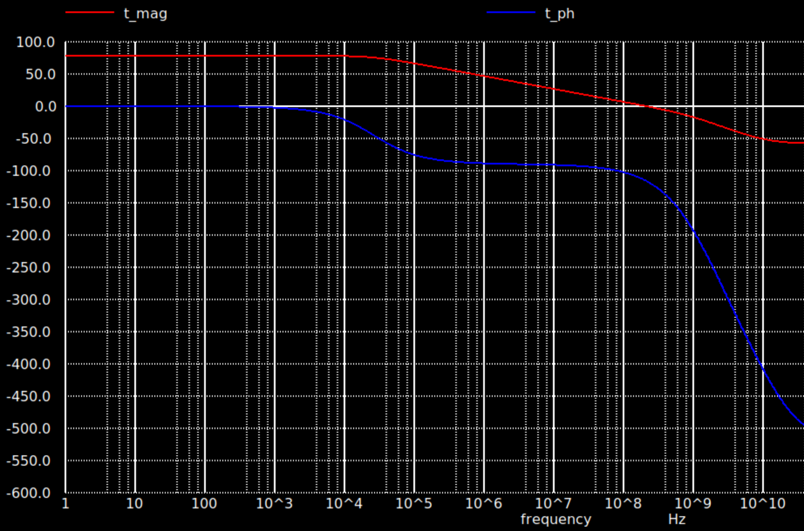

# Fully Differential Amplifier

## Self-Biasing Circuit

## Folded Cascode First Stage

## Folded Cascode Second Stage

## Common Mode Feedback Circuit

# Simulations 

## DC and Open Loop AC Simulations

|Metrics|Value|
|-------|-----|
|AC low frequency gain| 78.5 dB|
|Gain x Bandwidth| 216 MHz |
|Phase Margin| 62 deg |
|Static Power| 43.28 mW|

## Transient Simulation
