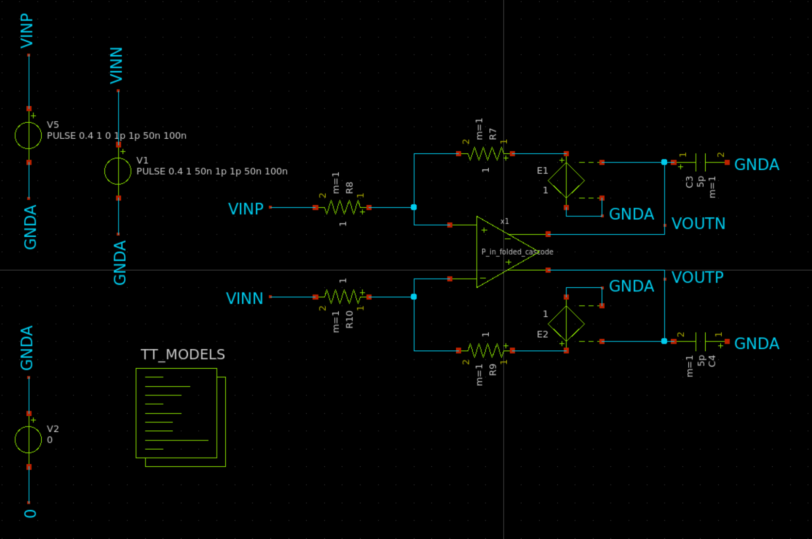
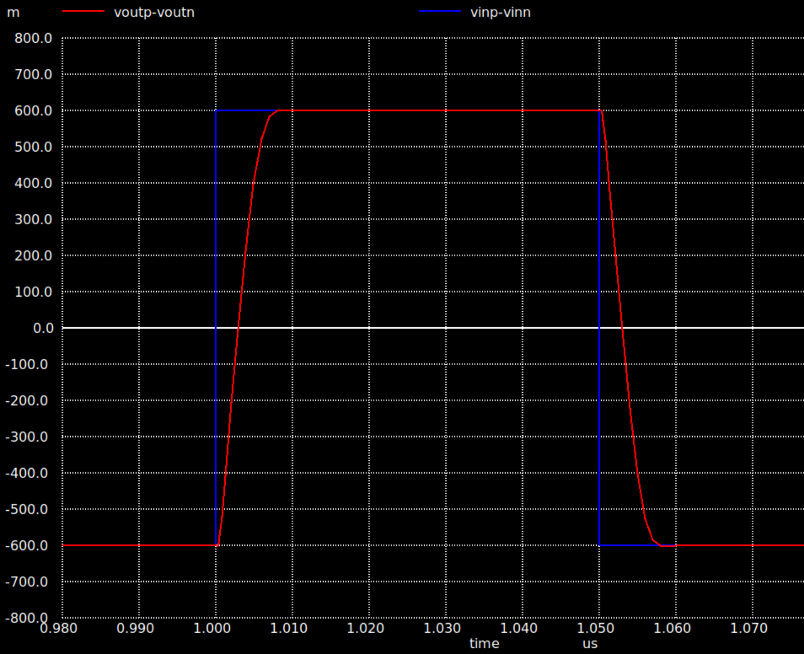

# Fully Differential Amplifier

A fully differential amplifier is amplifies the voltage difference between two input signals while rejecting common-mode signals, providing a balanced output and achieving high common-mode rejection ratio (CMRR).

In this design the input stage is folded cascode and the second stage is common source configuration. Folded cascode is selected to obtain high gain and robust biasing. A self biasing circuit is used to respond to changes in process corners and provide a common reference for the subcircuits. 

Every MOSFET in the design has a length of L=0.7um which makes the layout of the circuit easier to implement.

| Specifications            | Requirement                | ff Corner | tt Corner | ss Corner |
| ------------------------- | -------------------------- | --------- | --------- | --------- |
| Gain-Bandwidth Product    | > 200 MHz                  | 216 MHz   | 209 MHz   | 201 MHz   |
| Gain                      | > 70 dB                    | 78.5 dB   | 78.02 dB  | 77.4 dB   |
| Phase Margin              | > 60 deg                   | 62 deg    | 61.35 deg | 61.25 deg |
| Settling Time             | < 25 ns                    | 6.78 ns   | 6.9 ns    | 7.12 ns   |
| Slew Rate                 | > 20 V/us                  |221.7 V/us | 205 V/us  | 198.7 V/us|
| Differential Output Swing | 1.2 Vpp                    | 1.2 Vpp   | 1.2 Vpp   | 1.2 Vpp   |
| Power Consumption         | Optimize                   | 43.28 mW  | 37.17 mW  | 31.43 mW  |
| Load Capacitance          | 5 pF (at each output node) | 5 pF      | 5 pF      | 5 pF      |
| PSRR                      | 50 dB (single ended)       | 79 dB     |  78.56 dB |  78.07 dB |
| CMRR                      | 50 dB (single ended)       | 182 dB    |  187.2 dB |  194.58 dB|

| Subcircuit           | MOSFET       | W       | L   |
| -------------------- | ------------ | ------- | --- |
| Folded Cascode       | M1           | 58x9.5  | 0.7 |
| Folded Cascode       | M2,3         | 20x10.8 | 0.7 |
| Folded Cascode       | M4,5         | 60x11   | 0.7 |
| Folded Cascode       | M6,7         | 10x11.5 | 0.7 |
| Folded Cascode       | M8,9         | 5x3.7   | 0.7 |
| Folded Cascode       | M10,11       | 9x2.5   | 0.7 |
| Self Biasing         | M12          | 40x9.5  | 0.7 |
| Self Biasing         | M13,14       | 5x2.5   | 0.7 |
| Self Biasing         | M15          | 10x11.5 | 0.7 |
| Self Biasing         | M16,17       | 5x3.7   | 0.7 |
| Common Source        | M18,20      | 21x14.8 | 0.7 |
| Common Source        | M19,21      | 66x8    | 0.7 |
| Common Mode Feedback | M22,23       | 1x2.5   | 0.7 |
| Common Mode Feedback | M24,25,26,27 | 1x14.1  | 0.7 |
| Common Mode Feedback | M24,25       | 10x11   | 0.7 |

## Self-Biasing Circuit

## Folded Cascode First Stage

## Folded Cascode Second Stage

## Common Mode Feedback Circuit

# Simulations 

## DC and Open Loop AC Simulations

| Metrics               | ff corner | tt corner | ss corner |
| --------------------- | --------- | --------- | --------- |
| AC low frequency gain | 78.5 dB   | 78.02 dB  | 77.4 dB   |
| Gain x Bandwidth      | 216 MHz   | 209 MHz   | 201 MHz   |
| Phase Margin          | 62 deg    | 61.35 deg | 61.25 deg |   
| Static Current Draw   | 24.04 mA  | 20.65 mA  | 17.46 mA  |
| Static Power          | 43.28 mW  | 37.17 mW  | 31.43 mW  |
 
### ff Corner AC Simulation

### tt Corner AC Simulation
  

### ss Corner AC Simulation

## Transient Simulation

| Metrics           | ff Corner | tt Corner | ss Corner |
| ----------------- | --------- | --------- | --------- |
| Settling Time     | 6.78 ns   | 6.9 ns    | 7.12 ns   |
| Slew Rate         |221.7 V/us | 205 V/us  | 198.7 V/us|
| Diff. Output Swing| 1.2 Vpp   | 1.2 Vpp   | 1.2 Vpp   |

### Diff. Response to Diff. Pulse Input

#### ff Corner

#### tt Corner

#### ss Corner

### Diff. Response to Diff. Sine Input

#### ff Corner

#### tt Corner

#### ss Corner

## PSRR & CMRR Simulation
The simulation setup used for PSRR and CMRR is shown below.

| Metrics | ff Corner | tt Corner | ss Corner |
| ------- | --------- | --------- | --------- |
| PSRR    | 79 dB     |  78.56 dB |  78.07 dB |
| CMRR    | 182 dB    |  187.2 dB |  194.58 dB|

### ff Corner

### tt Corner

### ss Corner

